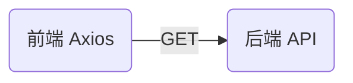

使用 one-openbmclapi-dashboard 的方法非常简单，只需要在后端提供一个 API 接口。

```mermaid
graph LR;
    A(前端 Axios) -- GET --> B(后端 API)
```

> **_“后端只需要提供数据，而前端要考虑的就多了。”_**

该系列文档会简要介绍如何为 one-openbmclapi-dashboard 提供所需要的 API 接口。
